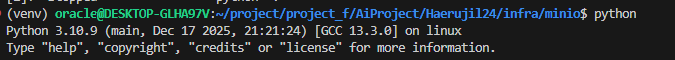

# Haerujil24
YOLO 기반 해루질 24 프로젝트

2025-12-17
minio 추가

파이썬 버전 3.10.9 로 통일
윈도우 리눅스 환경에서 문제 없음

2025-12-18
@@ 연습 Code 실행 방법

pwd>> Haerujil24/app/training

python testCode/train.py \
  --data coco128.yaml \
  --model yolov8n.pt \
  --imgsz 640 \
  --epochs 5 \
  --batch 16 \
  --device 0 \
  --mlflow_uri http://localhost:5000 \
  --experiment haerujil-yolo-s3 \
  --project runs \
  --name coco_test_s3

./mlflow 에서 학습 결과를 minio 에 적어야되는데 접속을 못하고 있음

